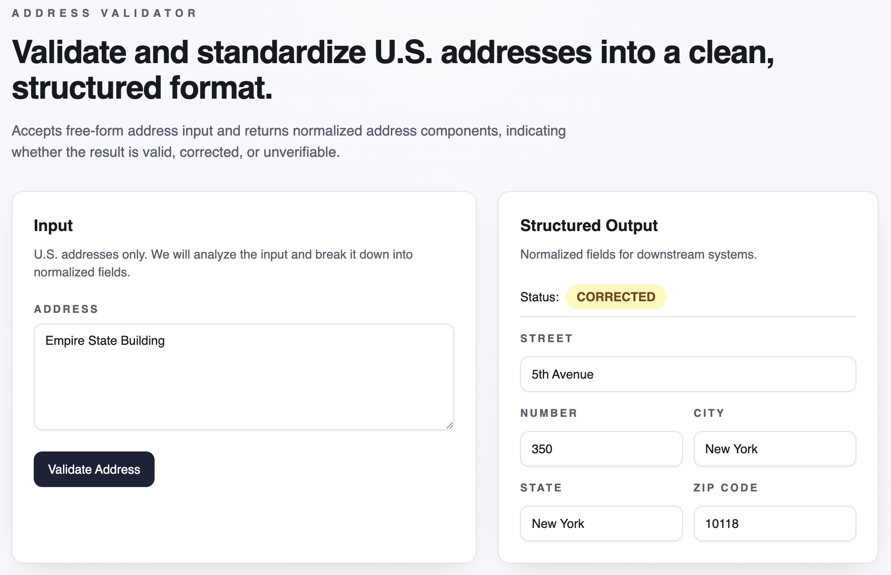
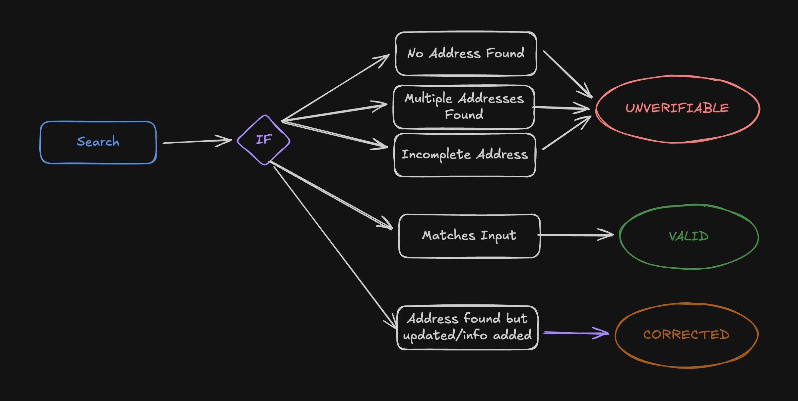

# 📦 Address Validator

Live demo: https://d309zik0lvuwhs.cloudfront.net/

A take-home interview project that implements a simple address validation flow end-to-end:

- `apps/web`: React + Vite UI for submitting an address and viewing results
- `apps/api`: NestJS API with a single validation endpoint and unit tests
- `infra`: IaC with AWS CDK
- Monorepo managed with `pnpm` workspaces

## Technologies Used

- 🧠 Language: TypeScript
- 🏗️ Backend: NestJS
- 🧪 Validation: Zod (runtime schemas + DTOs)
- ✅ Testing: Jest (unit tests)
- 🖥️ Frontend: React + Vite
- 🎨 Styling: Tailwind CSS
- 📦 Monorepo: `pnpm` workspaces
- 🧩 Shared Types: `@address-validator/types` (Zod + TypeScript)


## Architecture


- Runtime validation via Zod for both request and response contracts
- Address resolution abstracted behind an `AddressProvider` interface
- Shared `@address-validator/types` package enforces a single source of truth
- Serverless deployment (Lambda + API Gateway) to match real-world scalability patterns

## Getting Started

Pre-requisites:

- `Node.js`
- `pnpm`
- `Docker` (for Redis cache)

Install dependencies:

```bash
pnpm install
```

Build Packages:

```bash
pnpm build
```

Run the web app and API together:

```bash
pnpm dev
```

Once the development server is running, access the address validator UI at:

- http://localhost:5173



Or test the API directly with a tool like Postman:

- http://localhost:3000/validate-address

Example Request:

```json
{
  "address": "1 Infinite Loop, Cupertino, CA 95014"
}
```


## Address Provider Choice (Nominatim)

I selected the Nominatim public API (OpenStreetMap) as the initial provider because it is free and does not require an API key. Nominatim can also be self-hosted in the cloud if a fully self-managed setup is desired.

Other viable options include Google Maps Geocoding API, USPS, Smarty, and Mapbox.

Tradeoffs for Nominatim:

- ✅ Free and no API key required
- ✅ OpenStreetMap ecosystem with an option to run a self-managed instance
- ✅ Nominatim instance can be downloaded with only US region
- ⚠️ Rate limits and potential availability constraints on the public endpoint
- ⚠️ Data quality and normalization less consistent than paid providers
- ⚠️ No fuzzy search means typos won't be caught by Nominatim

The provider is accessed through an `AddressProvider` interface, so swapping providers later is a small, contained change.

In many production contexts, a paid provider such as **Google Maps Geocoding API** is a stronger default because of its reliability, coverage, and tooling. Concrete advantages:

- High-quality geocoding data across countries and regions
- Strong address normalization and disambiguation (handles typos, unit/suite formats, and partial inputs)
- Autocomplete and Places data improve UX and reduce invalid submissions
## Shared Types Package

I created a shared `@address-validator/types` package in the monorepo. Both the API and web app consume the same Zod schemas and TypeScript types, which prevents duplication and keeps contracts synchronized across the stack. This keeps the codebase easy to follow and enforces a single source of truth for validation and response shapes.

## Validation Logic (Explicit)

“Validation” in this project means resolving a free-form address into a structured, normalized representation using a third-party provider.

The API returns a structured address plus a status. The status is computed with the following rules:



## API

- Endpoint: `POST /validate-address`
- Request body:

```json
{
  "address": "1209 N Orange St, Wilmington, DE 19801"
}
```

- Response body (example):

```json
{
  "street": "Amphitheatre Parkway",
  "number": "1600",
  "city": "Mountain View",
  "state": "California",
  "zipCode": "94043",
  "status": "CORRECTED"
}
```

If the lookup fails or returns an incomplete result, the API returns:

```json
{ "status": "UNVERIFIABLE" }
```

If the upstream address provider is unavailable or errors, the API returns `502 Bad Gateway`.

## Caching (Redis)

The API uses Redis for response caching (POST `/validate-address` is cached based on the request body).

Why Redis for caching and throttling in this project:

- The API is deployed serverlessly (Lambda + API Gateway), which means multiple instances can run concurrently.
- In-memory caches and counters are instance-local, so they reset on cold starts and do not coordinate across instances.
- Redis provides a shared, centralized store that keeps cache entries and rate-limit counters consistent across all instances.

Start Redis + RedisInsight locally:

```bash
pnpm docker:up
```

By default, the API connects to:

- `REDIS_URL=redis://localhost:6379`

## Rate Limiting (Redis)

The API also uses Redis-backed rate limiting to protect the `/validate-address` endpoint from abuse and to demonstrate distributed throttling. This is implemented with the NestJS throttler guard and a Redis storage adapter (currently `@nest-lab/throttler-storage-redis`).

Default policy:

- 60 requests per minute per IP

Because the app is serverless and can scale horizontally, Redis is required to keep rate-limit counters consistent across instances.

## Configuration

- The web app defaults to `http://localhost:3000` for the API.
- You can override this by setting `VITE_ADDRESS_VALIDATOR_API_URL` at build time (e.g. in the Vite environment).
- Redis cache url defaults to `redis://localhost:6379``
- You can override this by setting `REDIS_URL` at build time.

## Repository Structure

- `apps/web`: React + Vite UI
- `apps/api`: NestJS API, schemas, providers, and unit tests
- `apps/types`: Shared data contracts and types for both backend and frontend
- `infra`: AWS CDK IaC for S3/CloudFront + Lambda/API Gateway

## Future Improvements

- Add IaC code to deploy a managed Redis instance
- Support additional providers (USPS, Smarty, Google, etc.) via the provider interface
- Expand validation semantics (e.g., Avenue vs Av, N vs North)
- Add E2E tests that hit Nominatim's API
- Add Nominatim locally as a docker image. Replace their public API with a managed one.

## AI Usage

AI tools were used as development assistants to speed up iteration and improve code quality.

- **OpenAI Codex / ChatGPT** were used to scaffold frontend components, experiment with UI layouts, and research address validation and autocomplete providers.
- **ChatGPT** assisted with API design decisions, edge-case handling (ambiguous or partial addresses), and debugging during development.
- **GitHub Copilot** was used for autocomplete, small refactors, and reducing boilerplate.

All AI-generated output was reviewed and adapted manually; final implementation and architectural decisions were made by me.

## Scope & Non-Goals

This project intentionally focuses on correctness, structure, and extensibility rather than exhaustive address intelligence.

Out of scope for this assessment:
- Fuzzy matching or typo correction
- International address normalization
- Persistent storage of validation results
